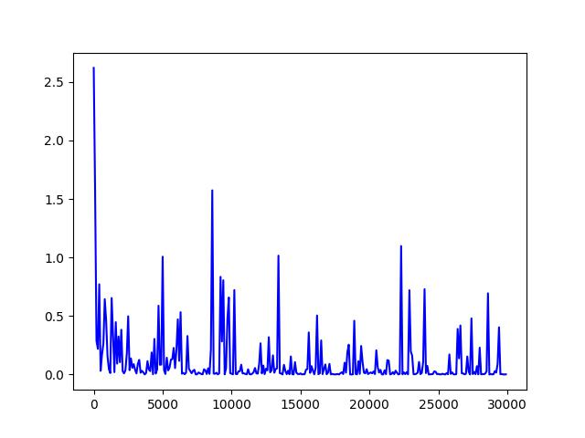
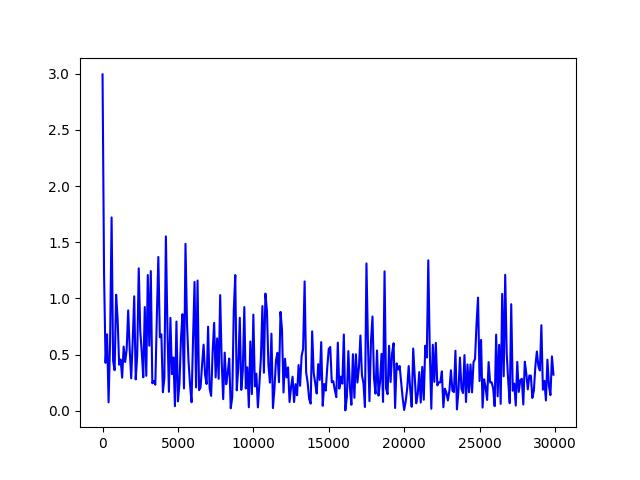

# programmers_dev_day1 - MNIST, Fashion-MNIST
Programmers Self-driving dev course. Day1 code

## Info

- frameworks : Pytorch
- model : Lenet5
- Dataset : MNIST and Fashion-MNIST

## Usage

Recommend to use virtual environments(Docker, conda).

### Prerequisite

pip install -r requirements.txt

### Run

- train

```bat
python main.py --mode train --download 1 --output_dir ${output_directory_path}
```

- eval

```bat
python main.py --mode eval --output_dir ${output_directory_path}
```

- test(show)

```bat
python main.py --mode test --output_dir ${output_directory_path}
```

## Result

### show loss graph

#### MNIST loss



#### Fashion-MNIST loss




### Accuracy

- MNIST : 99.14%
- Fashion-MNIST : 88.52%

### show sample result


## Reference

[Fashion-MNIST](https://www.kaggle.com/datasets/zalando-research/fashionmnist)

[MNIST](http://yann.lecun.com/exdb/mnist/)


