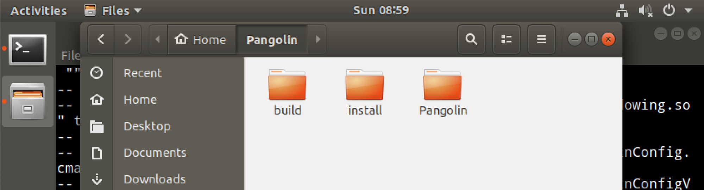
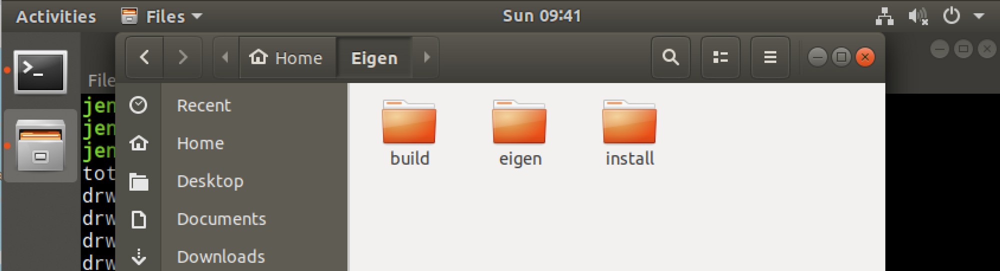

## ORB-SLAM3

### **Prerequisites**

> **Pangolin**
> 
> ```bash
> $ mkdir Pangolin
> $ cd Pangolin
> 
> # clone Pangolin along with it's submodules
> $ git clone --recursive https://github.com/stevenlovegrove/Pangolin.git
> $ cd Pangolin
> ```
> 
> ```bash
> # install dependencies (as described above, or your preferred method)
> $ ./scripts/install_prerequisites.sh recommended
> ```
> 
> 
> 
> file structure
> 
> ```bash
> $ mkdir build 
> $ mkdir install
> 
> $ cd build
> $ cmake -DCMAKE_BUILD_TYPE=Debug -DCMAKE_INSTALL_PREFIX=../install/ ../Pangolin/
> $ make -j4
> $ sudo make install
> ```

> **OpenCV**
> 
> 1. Check for Installation
>     
>     ```bash
>     $ pkg-config --modversion opencv
>     ```
>     
> 2. Upgrade Packages
>     
>     ```bash
>     $ sudo apt-get update
>     $ sudo apt-get upgrade
>     ```
>     
> 3. Install Required Packages before OpenCV Compilation
>     
>     ```bash
>     $ sudo apt-get install build-essential cmake
>     $ sudo apt-get install pkg-config
>     $ sudo apt-get install libjpeg-dev libtiff5-dev libpng-dev
>     $ sudo apt-get install libavcodec-dev libavformat-dev libswscale-dev libxvidcore-dev libx264-dev libxine2-dev
>     $ sudo apt-get install libv4l-dev v4l-utils
>     $ sudo apt-get install libgstreamer1.0-dev libgstreamer-plugins-base1.0-dev
>     $ sudo apt-get install libgtk2.0-dev
>     $ sudo apt-get install mesa-utils libgl1-mesa-dri libgtkgl2.0-dev libgtkglext1-dev
>     $ sudo apt-get install libatlas-base-dev gfortran libeigen3-dev
>     $ sudo apt-get install python2.7-dev python3-dev python-numpy python3-numpy
>     ```
>     or
>     ```bash
>     $ sudo apt-get -y install ffmpeg libgtk2.0-dev pkg-config libavcodec-dev libswscale-dev python-dev python-numpy libtbb2 libtbb-dev libjpeg-dev libpng-dev libtiff-dev libdc1394-22-dev
>     ```
>     
> 4. Set up and Compile and Install OpenCV
>     - Create and move a temporary directory to store source code
>         
>         ```bash
>         $ mkdir opencv
>         $ cd opencv
>         ```
>         
>     - OpenCV 4.4.0 source code download and unzip
>         
>         ```bash
>         $ wget -O opencv.zip https://github.com/opencv/opencv/archive/4.4.0.zip
>         $ unzip opencv.zip
>         ```
>         
>     - Contrib (Optional)
>         
>         ```bash
>         $ wget -O opencv_contrib.zip https://github.com/opencv/opencv_contrib/archive/4.4.0.zip
>         $ unzip opencv_contrib.zip
>         ```
>         
>     - Go to the opencv-4.4.0 directory and create a build directory.
>     Build directory and proceed with the compilation.
>         
>         ```bash
>         $ cd opencv-4.4.0
>         $ mkdir build
>         $ cd build
>         ```
>         
>     - Setting Compile
>         
>         ```bash
>         # without contrib
>         cmake -D CMAKE_BUILD_TYPE=RELEASE \
>         -D CMAKE_INSTALL_PREFIX=/usr/local \
>         -D WITH_TBB=OFF \
>         -D WITH_IPP=OFF \
>         -D WITH_1394=OFF \
>         -D BUILD_WITH_DEBUG_INFO=OFF \
>         -D BUILD_DOCS=OFF \
>         -D INSTALL_C_EXAMPLES=ON \
>         -D INSTALL_PYTHON_EXAMPLES=ON \
>         -D BUILD_EXAMPLES=OFF \
>         -D BUILD_TESTS=OFF \
>         -D BUILD_PERF_TESTS=OFF \
>         -D WITH_QT=OFF \
>         -D WITH_GTK=ON \
>         -D WITH_OPENGL=ON \
>         -D WITH_V4L=ON  \
>         -D WITH_FFMPEG=ON \
>         -D WITH_XINE=ON \
>         -D BUILD_NEW_PYTHON_SUPPORT=ON \
>         -D OPENCV_GENERATE_PKGCONFIG=ON \
>         -D OPENCV_ENABLE_NONFREE=ON .. 
>         ```
>         
>         ```bash
>         # contrib를 설치한 경우에는 extra modules path 명령어가 추가된다. 경로 설정에 유의해야 한다.
>         cmake -D CMAKE_BUILD_TYPE=RELEASE \
>         -D CMAKE_INSTALL_PREFIX=/usr/local \
>         -D WITH_TBB=OFF \
>         -D WITH_IPP=OFF \
>         -D WITH_1394=OFF \
>         -D BUILD_WITH_DEBUG_INFO=OFF \
>         -D BUILD_DOCS=OFF \
>         -D INSTALL_C_EXAMPLES=ON \
>         -D INSTALL_PYTHON_EXAMPLES=ON \
>         -D BUILD_EXAMPLES=OFF \
>         -D BUILD_TESTS=OFF \
>         -D BUILD_PERF_TESTS=OFF \
>         -D WITH_QT=OFF \
>         -D WITH_GTK=ON \
>         -D WITH_OPENGL=ON \
>         -D OPENCV_EXTRA_MODULES_PATH=../../opencv_contrib-4.4.0/modules \
>         -D WITH_V4L=ON  \
>         -D WITH_FFMPEG=ON \
>         -D WITH_XINE=ON \
>         -D BUILD_NEW_PYTHON_SUPPORT=ON \
>         -D OPENCV_GENERATE_PKGCONFIG=ON \
>         -D OPENCV_ENABLE_NONFREE=ON .. 
>         ```
>        
> 5. Compile
>     
>     ```bash
>     # CPU core check
>     $ cat /proc/cpuinfo | grep processor | wc -l
>     ```
>     
>     ```bash
>     # compile
>     $ make -j1
>     ```
>     
>     ```bash
>     # compile install 
>     $ sudo make install 
>     ```
>     
>     ```bash
>     # check /usr/local/lib configuration file
>     $ cat /etc/ld.so.conf.d/*
>     ```
>     
>     ```bash
>     # run /usr/local/lib additionally if the settings file is not found
>     $ sudo sh -c 'echo '/usr/local/lib' > /etc/ld.so.conf.d/opencv.conf'
>     ```
>     
>     ```bash
>     # run on additional operations → command to find opencv library at compile time
>     $ sudo ldconfig
>     ```
>     
> 6. Check OpenCV Installation Results
>     
>     ```bash
>     # C/C++
>     $ g++ -o facedetect /usr/local/share/opencv4/samples/cpp/facedetect.cpp $(pkg-config opencv4 --libs --cflags)
>     ```
>     
>     ```bash
>     $ ./facedetect --cascade="/usr/local/share/opencv4/haarcascades/haarcascade_frontalface_alt.xml" --nested-cascade="/usr/local/share/opencv4/haarcascades/haarcascade_eye_tree_eyeglasses.xml" --scale=1.3
>     ```

> **Eigen3**
> 
> 
> ```bash
> $ mkdir Eigen
> $ cd Eigen
> 
> $ git clone https://gitlab.com/libeigen/eigen.git
> ```
> 
> 
> 
> file structure
> 
> ```bash
> $ mkdir build 
> $ mkdir install
> 
> $ cd build
> $ cmake -DCMAKE_BUILD_TYPE=Debug -DCMAKE_INSTALL_PREFIX=../install ../eigen/
> $ make -j4
> $ sudo make install
> ```

> **DBoW2 and g2o → Included in Thirdparty Folder**

> **Python**

> **ROS → Optional**

> **Building ORB-SLAM3 Library**
> ```bash
> $ git clone https://github.com/UZ-SLAMLab/ORB_SLAM3.git ORB_SLAM3
> ```
> 
> ```bash
> $ cd ORB_SLAM3
> $ chmod +x build.sh
> $ ./build.sh
> ```
> 
> 
> 
> build success !
>


### **Monocular**

> **Monocular**
> 
> ```bash
> ./Examples/Monocular/mono_kitti Vocabulary/ORBvoc.txt ./Examples/Monocular/KITTI00-02.yaml ./Dataset/KITTI/00/00
> ```
<video controls width="500">
    <source src = "video/SLAM RUN.mov" type="video/mov">
</video>

### evo Package, Trajectory

> **evo Package, Trajectory**
---